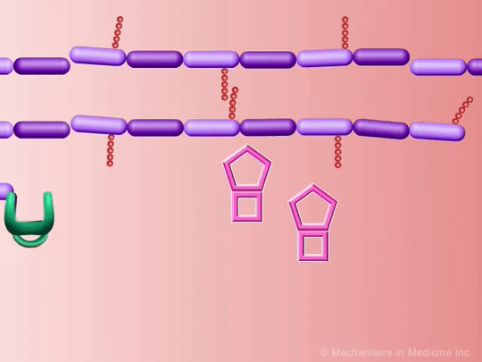

# Mechanisms-of-Action-MoA-Prediction
Competition based on classifying drugs based on their biological activity. This competition is a multilabel classification task.

## What is the Mechanism of Action (MoA) of a drug? And why is it important?

In the past, scientists derived drugs from natural products or were inspired by traditional remedies. Very common drugs, such as paracetamol, known in the US as acetaminophen, were put into clinical use decades before the biological mechanisms driving their pharmacological activities were understood. Today, with the advent of more powerful technologies, drug discovery has changed from the serendipitous approaches of the past to a more targeted model based on an understanding of the underlying biological mechanism of a disease. In this new framework, scientists seek to identify a protein target associated with a disease and develop a molecule that can modulate that protein target. As a shorthand to describe the biological activity of a given molecule, scientists assign a label referred to as mechanism-of-action or MoA for short.

## What have I developed?
- Support Vector Machine
- Simple Neuronal Network (2 hiden layers)
- Split Neuronal Network (3 NN concatenated)

## What am I currently working on?
- Improve SVM model for run in GPU
- Hypertune and improve both NN models (PCA, extended feature selection, manipulating data, etc.)
- Add a new model (probably another NN using a new arquitecture and maybe pytorch)
- Use ensemble learning with the best models

